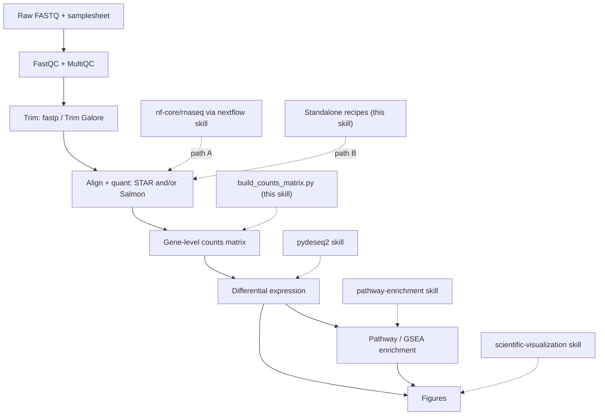

# Bulk RNA-seq

## Overview

This skill orchestrates a complete, **defensible** bulk RNA-seq differential-expression study, from raw sequencing reads to enriched pathways and figures. It is a router, not a reimplementation: most stages already have dedicated skills in this repo, and this skill connects them in the right order, fills the one real gap (raw reads → a gene-level counts matrix), and enforces the design and QC decisions that determine whether the final result is trustworthy.

"Defensible" means three things, applied throughout:
- **Reproducible** — pinned pipeline/tool versions, containers where possible, recorded parameters, fixed random seeds.
- **Quality-gated** — QC is inspected and acted on before, during, and after quantification, not skipped.
- **Statistically sound** — adequate replication, a design that matches the biology, counts handled correctly, and FDR-controlled testing.

The pipeline is: **FastQC/trim → align/quant (STAR/Salmon) → counts → DE (pydeseq2) → enrichment (pathway-enrichment) → figures**.

## When to Use This Skill

Use this skill when the user wants to:
- Go from FASTQ files (or a sequencing run) to differentially expressed genes and pathways.
- Run or configure `nf-core/rnaseq`, or align/quantify with STAR, Salmon, or featureCounts.
- Turn Salmon/STAR/featureCounts output into a counts matrix ready for DESeq2/PyDESeq2.
- Design or sanity-check a bulk RNA-seq experiment (replicates, batch, strandedness) before committing compute.
- Scope an end-to-end RNA-seq analysis and decide which tools and skills to chain.

Typical prompts: "analyze my RNA-seq", "FASTQ to DESeq2", "run nf-core/rnaseq", "STAR/Salmon quantification", "build a counts matrix for DESeq2", or "go from reads to differentially expressed genes and enriched pathways".

The stages and the tools/skills they use: QC and trimming (FastQC, fastp/Trim Galore), alignment and quantification (STAR, Salmon, featureCounts), then handoff to differential expression (`pydeseq2`), pathway/GSEA enrichment (`pathway-enrichment`), and publication figures (`scientific-visualization`). The reads → counts stage routes between an nf-core/rnaseq (Nextflow) path and a standalone STAR/Salmon path, and the skill covers experimental design, strandedness, and QC gates throughout.

This is **bulk** RNA-seq (samples = biological specimens). For single-cell/nuclei data use `scanpy`; for the DE statistics alone use `pydeseq2`; for enrichment alone use `pathway-enrichment`.

## The Pipeline at a Glance



## Two Upstream Paths — Pick One

The reads → counts stage can be run two ways. They produce equivalent gene counts; choose by context, then stay on that path.

| Use **Path A — `nf-core/rnaseq`** when… | Use **Path B — standalone tools** when… |
|------------------------------------------|------------------------------------------|
| You want the field-standard, audited, citable pipeline with one command | You have a few samples and want to learn/inspect each step |
| Many samples, or you'll scale to HPC/cloud | No Nextflow/containers available, or a constrained environment |
| Reproducibility and a full MultiQC report matter most | You need a non-standard step the pipeline doesn't expose |
| → Drive it through the **`nextflow`** skill | → Follow `references/upstream-manual.md` |

When unsure, prefer **Path A**: `nf-core/rnaseq` already wires together FastQC → trimming → STAR/Salmon → quantification → tximport → MultiQC with sensible, reviewed defaults, which is the most defensible option. Path B exists for transparency and constrained setups.

Both paths converge on a **gene-level counts matrix**, after which the workflow is identical.

## Setup

```bash
# This skill's glue (bridge + handoffs) — Python
uv pip install pytximport pandas

# Downstream skills install their own deps:
#   pydeseq2 skill           -> uv pip install pydeseq2
#   pathway-enrichment skill -> uv pip install gseapy gprofiler-official

# Path A (nf-core): only Nextflow + a container engine are needed — see the `nextflow` skill.

# Path B (standalone tools): install via bioconda. Pin versions for reproducibility.
conda create -n rnaseq -c bioconda -c conda-forge \
  fastqc fastp trim-galore "star=2.7.11b" "salmon=1.10.3" subread multiqc
```

Record the exact versions you use (pipeline revision, tool versions, reference genome + annotation release) — they belong in the methods section and make the analysis reproducible.

## Quick Start

### Path A — nf-core/rnaseq (recommended)

```bash
# 0. Validate the samplesheet first (catches the most common failures early)
python scripts/validate_samplesheet.py --samplesheet samplesheet.csv

# 1. Smoke-test the environment with tiny bundled data
nextflow run nf-core/rnaseq -r 3.26.0 -profile test,docker --outdir test_results

# 2. Real run: pin the revision, pick an aligner, pass a samplesheet + reference
nextflow run nf-core/rnaseq -r 3.26.0 \
  -profile docker \
  --input samplesheet.csv \
  --genome GRCh38 \
  --aligner star_salmon \
  --outdir results \
  -resume
```

`nf-core/rnaseq` runs tximport internally, so gene counts come out **already merged** — no bridge script needed. Use `results/star_salmon/salmon.merged.gene_counts_length_scaled.tsv` for DE. Samplesheet format, aligner choice, and outputs: `references/upstream-nfcore.md`. For engine/HPC/cloud/container detail, use the **`nextflow`** skill.

### Path B — standalone STAR/Salmon (abbreviated)

```bash
fastqc -o qc/ reads/*.fastq.gz                      # 1. QC raw reads
fastp -i s1_R1.fq.gz -I s1_R2.fq.gz \
      -o s1_R1.trim.fq.gz -O s1_R2.trim.fq.gz \
      --thread 4 -j s1.fastp.json                   # 2. Trim adapters/low-quality
salmon quant -i salmon_index -l A \
      -1 s1_R1.trim.fq.gz -2 s1_R2.trim.fq.gz \
      --gcBias --seqBias -p 8 -o quant/s1            # 3. Quantify (per sample)
```

Full recipes (FastQC, fastp/Trim Galore, STAR index+align+`--quantMode GeneCounts`, Salmon decoy-aware index, featureCounts, strandedness): `references/upstream-manual.md`.

### Counts → DE → enrichment (both paths)

```bash
# Path B only: assemble a gene x sample counts matrix + metadata template for PyDESeq2
python scripts/build_counts_matrix.py --from salmon \
  --quant-dir quant/ --tx2gene tx2gene.tsv --output-dir counts/

# Then hand off (see the dedicated skills):
#   pydeseq2:           counts.csv + metadata.csv -> DE table (log2FC, padj, stat)
#   pathway-enrichment: rank by `stat` (GSEA) or padj+|LFC| hit list (ORA)
#   scientific-visualization / matplotlib: volcano, MA, heatmap, PCA, enrichment dotplot
```

## Stage-by-Stage Workflow

Work top to bottom. Each stage names the skill or file that owns the detail. Don't skip the design/QC stages — they are where bulk RNA-seq studies most often go wrong.

1. **Design & sample sheet.** Confirm ≥3 biological replicates per group, identify batch/confounders, and choose the comparison(s). Build the samplesheet and validate it with `scripts/validate_samplesheet.py`. Rationale and rules: `references/design-and-qc.md`.
2. **Raw-read QC.** FastQC per file; aggregate with MultiQC. Check per-base quality, adapter content, duplication, and over-representation. Thresholds: `references/design-and-qc.md`.
3. **Trimming.** Remove adapters and low-quality tails (via `fastp` or `Trim Galore`). Re-run FastQC to confirm. Recipes: `references/upstream-manual.md` (Path A does this for you).
4. **Align / quantify.** STAR (genome alignment + `--quantMode GeneCounts`) and/or Salmon (transcript quasi-mapping, decoy-aware). Determine strandedness — it is easy to get wrong and silently halves your counts. Detail: `references/upstream-manual.md`; pipeline params: `references/upstream-nfcore.md`.
5. **Build the counts matrix.** Turn quant output into a gene × sample integer matrix and a metadata template (`scripts/build_counts_matrix.py`). The estimated-count and gene-ID-mapping nuances live in `references/counts-and-handoff.md`.
6. **Differential expression → `pydeseq2` skill.** Load `counts.csv` + `metadata.csv`, set the design (e.g. `~batch + condition`), fit, and test with FDR control. Inspect the PCA and p-value histogram as QC.
7. **Enrichment → `pathway-enrichment` skill.** For GSEA, rank the *full* gene list by the DESeq2 `stat`; for ORA, pass the thresholded hit list (padj < 0.05, optionally |log2FC| > 1). Map gene IDs to symbols first.
8. **Figures → `scientific-visualization` skill.** Volcano, MA, sample-distance heatmap, PCA, and enrichment dotplots, plus the MultiQC report for the QC narrative.

## The counts → DE bridge (the key glue)

This is the one stage with no upstream/downstream skill, so this skill owns it. `scripts/build_counts_matrix.py` converts quant output into exactly what `pydeseq2` expects:

- **Salmon** (`--from salmon`): aggregates per-sample `quant.sf` to gene level with `pytximport` using `counts_from_abundance="length_scaled_tpm"` (the right choice for gene-level DE), needs a `tx2gene` map.
- **STAR** (`--from star`): reads each `ReadsPerGene.out.tab`, selecting the column for your `--strandedness` (unstranded/forward/reverse).
- **featureCounts** (`--from featurecounts`): parses the combined `featureCounts` matrix.

It writes `counts.csv` (genes × samples, integers) and `metadata_template.csv` (one row per sample) for you to fill in. **Salmon/RSEM counts are estimates (non-integer); they are rounded to integers** because PyDESeq2 requires integer counts — see `references/counts-and-handoff.md` for why this is acceptable with `length_scaled_tpm` and how it differs from the offset-based DESeq2+tximport route. That reference also covers Ensembl→symbol mapping (needed before enrichment) and the exact orientation PyDESeq2 wants.

## Common Pitfalls

These cause most wrong or irreproducible bulk RNA-seq results:

1. **Too few replicates.** <3 biological replicates per group gives almost no power and unstable dispersion estimates. More replicates beat deeper sequencing.
2. **Confounded batch and condition.** If every treated sample was processed on a different day/lane than controls, the effect is unrecoverable. Randomize, and model known batches (`~batch + condition`). See `references/design-and-qc.md`.
3. **Wrong strandedness.** Choosing the wrong STAR column or featureCounts `-s`/Salmon library type silently discards ~half the reads. Use Salmon `-l A` or infer strandedness, and verify the assigned-reads fraction.
4. **Feeding TPM/FPKM to DESeq2.** DESeq2 needs raw (or length-scaled) **counts**, never TPM/FPKM/normalized values. The bridge handles this.
5. **Non-integer counts.** PyDESeq2 requires integers; round Salmon estimates (the bridge does this).
6. **Gene-ID mismatch into enrichment.** DESeq2 output is often Ensembl IDs; Enrichr/MSigDB want symbols. Map IDs before `pathway-enrichment` or "nothing is significant".
7. **Skipping post-quant QC.** Always look at the PCA and sample-distance heatmap before trusting DE — they expose swapped labels, outliers, and hidden batches.
8. **Mixing aligners across samples.** Quantify every sample with the same tool, version, reference, and parameters.
9. **Unpinned versions.** "latest" pipelines/genomes make results unreproducible; pin `-r`, tool versions, and the genome/annotation release.

## Integration with Other Skills

- **Upstream execution:** `nextflow` (runs `nf-core/rnaseq`, Path A; HPC/cloud/containers).
- **Reference data / gene IDs:** `gget` (`gget ref` for genome+GTF, `gget info`/`gget search` for ID mapping), `database-lookup` (Ensembl/NCBI), `biopython`/`pysam` (FASTA/BAM handling).
- **Differential expression:** `pydeseq2` (the DE engine this skill hands counts to).
- **Enrichment:** `pathway-enrichment` (ORA + GSEA; its `scripts/run_enrichment.py` reads a DESeq2 results CSV directly).
- **Figures & reporting:** `scientific-visualization`, `matplotlib`, `seaborn`; `scientific-writing` for the methods/results narrative.
- **Related but distinct:** `scanpy` (single-cell), `statistical-analysis` (multiple-testing depth).

## Reference Files

Read the relevant file when you need depth — each is self-contained:

- `references/upstream-nfcore.md` — Path A: samplesheet format, `--aligner`/`--pseudo_aligner` choice, key params, the `salmon.merged.gene_counts*.tsv` outputs, MultiQC, and what to hand to `pydeseq2`.
- `references/upstream-manual.md` — Path B: FastQC, fastp/Trim Galore, STAR genome index + alignment + `--quantMode GeneCounts`, Salmon decoy-aware index + `quant`, featureCounts, and how to determine strandedness.
- `references/counts-and-handoff.md` — turning quant output into PyDESeq2-ready `counts.csv`/`metadata.csv` (pytximport, STAR column selection, featureCounts), the integer/estimated-count nuance, Ensembl→symbol mapping, and the DE→enrichment rank/hit-list recipe.
- `references/design-and-qc.md` — experimental design (replication, batch, confounding, design formulas) and QC-metric interpretation (mapping rate, duplication, rRNA, complexity, PCA/outliers) — the defensible-pipeline backbone.

## Resources

- nf-core/rnaseq: https://nf-co.re/rnaseq · STAR: https://github.com/alexdobin/STAR · Salmon: https://salmon.readthedocs.io
- fastp: https://github.com/OpenGene/fastp · Trim Galore: https://github.com/FelixKrueger/TrimGalore · MultiQC: https://multiqc.info
- pytximport: https://pytximport.complextissue.com · featureCounts (Subread): https://subread.sourceforge.net
- Method background: Love et al. 2014 (DESeq2) DOI 10.1186/s13059-014-0550-8 · Soneson et al. 2015 (tximport) DOI 10.12688/f1000research.7563.2
