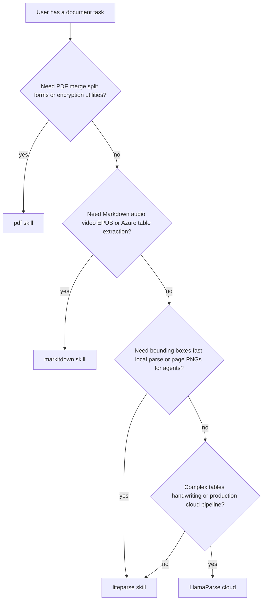

# Choosing a Document Parser

Use this guide to pick the right tool in the scientific-agent-skills repo (or LlamaParse for cloud escalation).

## Comparison table

| Criterion | LiteParse | MarkItDown | pdf skill | LlamaParse |
|-----------|-----------|------------|-----------|------------|
| **Primary output** | Layout text + JSON with bboxes | Markdown | PDF bytes / extracted text | Structured markdown / JSON (cloud) |
| **Runs locally** | Yes | Yes | Yes | No (cloud API) |
| **Bounding boxes** | Yes | No | Limited | Yes (cloud) |
| **OCR** | Tesseract + optional HTTP OCR | Yes (images/PDF) | Via external tools | Advanced |
| **Page screenshots** | Yes (PNG) | No | Image extract only | Varies |
| **Office → text** | Via LibreOffice convert | Native converters | N/A | Yes |
| **Audio / video / EPUB** | No | Yes | No | Some formats |
| **PDF merge / split / forms** | No | No | Yes | No |
| **Best for** | RAG grounding, agent vision, batch PDF corpus | LLM-friendly Markdown pipelines | PDF manipulation | Hard documents at scale |

## Decision rules

### Choose **LiteParse** when

- You need **coordinates** for citations, highlighting, or layout-aware chunking.
- You want **fast local** parsing without API keys.
- You are building **multimodal** workflows (parse JSON + page screenshots).
- You are batch-processing **folders of PDFs** for a literature review pipeline.
- Scanned PDFs need **OCR** with optional custom HTTP OCR backends.

### Choose **MarkItDown** when

- The downstream step expects **Markdown** (RAG, summarization, notebook ingestion).
- Inputs include **HTML, EPUB, audio, YouTube**, or you want **Azure Document Intelligence** for tables.
- You do not need per-span bounding boxes.

### Choose the **pdf** skill when

- The task is **PDF file operations**: merge, split, rotate, watermark, fill forms, encrypt/decrypt.
- You only need simple text extraction without spatial layout or OCR orchestration.

### Choose **LlamaParse** when

- Documents have **dense tables, multi-column layouts, charts, or handwriting** beyond what local parsers handle well.
- You are building a **production document pipeline** and accept cloud dependency and signup.

Link: https://docs.cloud.llamaindex.ai/llamaparse/overview

## Combining tools

Common pipelines:

1. **LiteParse → chunk + embed** — JSON/text for vector store; bboxes for UI highlights.
2. **LiteParse screenshots + vision model** — figures and tables; text JSON for search.
3. **LiteParse text → MarkItDown-style post-processing** — only if you must have Markdown; otherwise use LiteParse text directly.
4. **pdf skill merge** → **LiteParse parse** — assemble supplementary PDFs, then extract.

Avoid running LiteParse and MarkItDown on the same file unless you have distinct consumers (coordinates vs Markdown).
